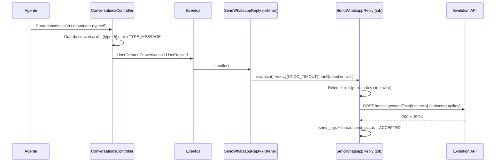

# Canal de WhatsApp (Evolution API)

## Objetivo

Añadir WhatsApp como **tipo propio de conversación** en FreeScout y enviar realmente las respuestas
salientes a través de una instancia de [Evolution API](https://doc.evolution-api.com) configurada
**por buzón**.

Requisitos acordados con el usuario:

1. El tipo debe aparecer **en los dos sitios**: en el formulario de nueva conversación y en las
   opciones/tipos (selector de los tokens del módulo `RestApi`).
2. El envío debe ser **real** por WhatsApp (no solo marcar el tipo).
3. Proveedor: **Evolution API**.
4. Credenciales: **por buzón** (Ajustes del buzón).
5. Representación: **tipo propio** `Conversation::TYPE_WHATSAPP = 5` (no reutilizar el tipo "Llamada").

## Estado

Implementado y **verificado end-to-end** el **envío saliente** (mensajes nuevos y respuestas).
Ver §"Verificación" para el detalle y §"Pendiente" para lo que queda fuera.

## Cambios

### Tipo de conversación

| Archivo | Cambio |
| --- | --- |
| `app/Conversation.php` | `TYPE_WHATSAPP = 5`, incluido en `$types`, `typeToName()`, `isWhatsapp()`. |
| `resources/views/js/vars.blade.php` | `conv_type_whatsapp: '{{ \App\Conversation::TYPE_WHATSAPP }}'`. Requiere ejecutar `php artisan freescout:generate-vars` para regenerar `storage/app/public/js/vars.js`. |

### Formulario de nueva conversación

| Archivo | Cambio |
| --- | --- |
| `resources/views/conversations/create.blade.php` | Botón `#whatsapp-conv-switch` junto al de llamada. Reutiliza los campos de cliente de las conversaciones telefónicas (nombre + teléfono) y solo cambia el tipo: `is_note=0`, `is_phone=0`, `type=WhatsApp`. Si la conversación abierta ya es de tipo WhatsApp (borrador) se activa automáticamente. |
| `app/Http/Controllers/ConversationsController.php` | `$is_whatsapp` a partir de `$request->type`; validación de nombre/teléfono (no de destinatario de correo); `processPhoneCustomer()` para nuevas conversaciones de WhatsApp; se omite el check de "Receptores incorrectos"; mensaje flash propio ("WhatsApp: mensaje enviado"). |

Notas de por qué se reutiliza el flujo de "phone":

- El hilo queda con `Thread::TYPE_MESSAGE` (no nota), así se disparan los eventos `UserCreatedConversation`
  / `UserReplied` que necesita el envío.
- El cliente se crea sin correo si no se indica uno, pero el campo de correo opcional sigue disponible
  (`processPhoneCustomer()` lo asocia si se rellena).

### Envío saliente

| Archivo | Cambio |
| --- | --- |
| `app/Misc/EvolutionApi.php` | Cliente mínimo: `sendText()`, `sendMedia()`, `connectionState()`, `normalizeNumber()`, `forMailbox()`. Cabecera `apikey`, `\Helper::setGuzzleDefaultOptions()`. Devuelve `false` + `getLastError()` en error, nunca lanza excepción. |
| `app/Listeners/SendWhatsappReply.php` | Escucha `UserCreatedConversation` y `UserReplied`; si la conversación es de WhatsApp, encola `App\Jobs\SendWhatsappReply` en la cola `emails` con el mismo retardo "Deshacer" que los correos. |
| `app/Jobs/SendWhatsappReply.php` | Entrega real. Relee el hilo y **no envía** si falta, si no es `TYPE_MESSAGE`, si no está `STATE_PUBLISHED` (soporta Deshacer) o si ya está `ACCEPTED`. Convierte el HTML a texto plano, resuelve el número (cliente → `thread.to` → `customer_email`), llama a Evolution API, reintenta 3 veces con 5 min de espera y registra el resultado. |
| `app/Listeners/SendReplyToCustomer.php` | Salida temprana para conversaciones de WhatsApp: el correo no se envía (antes se intentaba y fallaba al no haber correo del cliente). |
| `app/Providers/EventServiceProvider.php` | Registro de `SendWhatsappReply` en `UserReplied` y `UserCreatedConversation`. |

### Configuración por buzón

| Archivo | Cambio |
| --- | --- |
| `app/Mailbox.php` | `getWhatsappSettings()`, `setWhatsappSettings()`, `isWhatsappEnabled()`, `encryptWhatsappApiKey()`. Se guarda en `mailboxes.meta['whatsapp']` y **la API key se cifra** con `\Helper::encrypt()` (el cifrado es idempotente: no se vuelve a cifrar una clave ya cifrada). |
| `resources/views/mailboxes/update.blade.php` | Bloque "WhatsApp" en Ajustes del buzón: casilla de activación, URL base, instancia y API key (dejar vacío = mantener la guardada). |
| `app/Http/Controllers/MailboxesController.php` | Validación (`whatsapp_url|whatsapp_instance|whatsapp_apikey`) y persistencia junto al resto de metadatos. |

### Opciones / tokens de API (módulo `RestApi`)

| Archivo | Cambio |
| --- | --- |
| `Modules/RestApi/Entities/ApiKey.php` | `CONVERSATION_TYPES` (email, web_form, sms, call, whatsapp), `conversation_type` fillable, `getConversationTypes()`, `getConversationTypeName()`. Se conservan por compatibilidad de la columna, pero **ya no se aplican**. |
| `Modules/RestApi/Http/Controllers/ApiTokenController.php` | Se **eliminó** la validación y el guardado de `conversation_type`: los tokens no tienen restricción por medio. |
| `Modules/RestApi/Resources/views/apitokens/index.blade.php` | Se **eliminaron** la columna "Tipo" y el `<select>` del modal; se añade una nota de que no hay restricción por medio. |
| `Modules/RestApi/Resources/lang/{es,en}/apitokens.php` | Cadenas del nuevo campo / nota de restricción. |
| `Modules/RestApi/Tests/Unit/ApiKeyTest.php` | `test_conversation_type_round_trip`, `test_conversation_type_is_optional`. |

**Los tokens no están restringidos por tipo de medio:** el mismo token opera con email,
teléfono, chat, personalizado y WhatsApp. Solo se mantiene la restricción **por buzón**
(`mailbox_ids`).

### Traducciones

`resources/lang/es.json`: 12 cadenas nuevas del canal de WhatsApp.

## Endpoints con varios tipos de medio

Los endpoints REST de conversaciones e hilos admiten todos los medios, incluido WhatsApp:

| Archivo | Cambio |
| --- | --- |
| `Modules/RestApi/Support/Channels.php` | Helper de canales: nombres (`email`/`phone`/`chat`/`custom`/`whatsapp`), validaciones por medio, `check()` de configuración del buzón y `queueDelivery()`. |
| `Modules/RestApi/Http/Requests/StoreConversationRequest.php` | Valida `type` 1-5 o `channel` por nombre; reglas condicionales (email exige `to`, telefonía/WhatsApp exigen teléfono); flag `send_message`. |
| `Modules/RestApi/Http/Requests/StoreThreadRequest.php` | Añade `send_message` (alias `send`). |
| `Modules/RestApi/Http/Controllers/ConversationsController.php` | `store()` crea conversaciones de cualquier medio, resuelve el cliente por email/teléfono y encola la entrega. |
| `Modules/RestApi/Http/Controllers/ThreadsController.php` | `store()` resuelve el destinatario según el medio, valida la configuración y encola la entrega. |
| `Modules/RestApi/Http/Controllers/CustomersController.php` | `update()`/`destroy()` implementados (las rutas ya existían sin método). |
| `Modules/RestApi/Entities/DTOs/ConversationDTO.php` | Expone `type_name` y `channel`. |
| `Modules/RestApi/Entities/DTOs/ThreadDTO.php` | Expone `send_status` y `send_status_name`. |

**Entrega:** `Channels::queueDelivery()` encola `App\Jobs\SendWhatsappReply` (WhatsApp) o
`App\Jobs\SendReplyToCustomer` (email) en la cola `emails`. Por defecto WhatsApp se entrega; email
solo si `send_message=true` (compatibilidad con el comportamiento histórico).

**Errores informados:** antes de encolar se valida el buzón y se responde `422` con un código
estable cuando falta configuración: `whatsapp_not_configured`, `email_not_configured`,
`phone_required`, `unsupported_channel`, `customer_unresolved`.

**Documentación:** `docs/qchat-integration.md` (guía) y `docs/openapi.yaml` (OpenAPI 3.0).

## Cómo funciona un envío

- El envío se hace por la cola `emails`, así que requiere el worker de FreeScout en marcha
  (`php artisan queue:work`), igual que los correos.
- En el flujo web el job se encola a través de los listeners de `UserCreatedConversation` /
  `UserReplied`; en el flujo API (`send_message`) se encola directamente desde
  `Modules\RestApi\Support\Channels::queueDelivery()`.
- "Deshacer" funciona: `undoReply()` pasa el hilo a `STATE_DRAFT` y el job aborta antes de enviar.

## Verificación

Script temporal (eliminado tras la verificación) ejecutando el **controlador real** contra la base de
datos `freescout-test` y un **servidor Evolution API falso** (`php -S 127.0.0.1:9321`) que registra
peticiones:

**54/54 comprobaciones correctas**, entre ellas:

- Compilación de las plantillas Blade modificadas.
- `TYPE_WHATSAPP = 5`, `isWhatsapp()`, `typeToName()`.
- Ajustes del buzón: la API key se guarda **cifrada**, se descifra en la lectura, no se cifra dos veces y
  `isWhatsappEnabled()` exige activado + URL + instancia + clave.
- Cliente: `normalizeNumber('+34 600-11 22 33') = '34600112233'`; sin credenciales y con API inalcanzable
  devuelve `false` con mensaje de error (sin excepciones).
- **Conversación nueva por WhatsApp** (vía `ConversationsController::ajax()`): conversación guardada con
  `type=5`, hilo `TYPE_MESSAGE` publicado, cliente creado con el teléfono, `send_logs` con estado
  `ACCEPTED`, `thread.send_status = 1`, y petición real `POST /message/sendText/inst-test` con la cabecera
  `apikey` y el payload normalizado (`number=34600112233`, texto plano).
- **Respuesta** a una conversación de WhatsApp existente: nuevo hilo `TYPE_MESSAGE`, registrado como
  `ACCEPTED`, segunda petición a Evolution API con el texto nuevo.
- **Buzón sin configurar**: la conversación se crea igualmente y el hilo queda con error
  ("WhatsApp is not configured for this mailbox"), sin petición HTTP.
- **Sin teléfono del cliente**: error registrado, sin petición HTTP.

### Dos bugs reales encontrados durante la verificación

1. `ConversationsController::ajax()` daba "Receptores incorrectos" en una conversación nueva de WhatsApp:
   el check de destinatarios solo excluía `$is_phone`/`$is_custom`. Corregido añadiendo `!$is_whatsapp`.
2. `thread.send_status` no se actualizaba: el envío daba por hecho que `App\Observers\SendLogObserver`
   sincronizaba el estado del hilo, pero **ese observador no está registrado** en `AppServiceProvider`.
   El job ahora actualiza `send_status` + `updateSendStatusData()` explícitamente, igual que hace
   `App\Jobs\SendReplyToCustomer` con los correos.

## Pendiente / limitaciones conocidas

1. **Mensajes entrantes:** no implementado. Habría que exponer un webhook que reciba de Evolution API
   (`messages.upsert`) y cree/actualice conversaciones e hilos `Thread::TYPE_CUSTOMER`
   (`Conversation::TYPE_WHATSAPP`, `customer->phones`).
2. **Adjuntos:** solo se registra un aviso en el log de envío; `EvolutionApi::sendMedia()` está listo pero
   no se usa porque FreeScout sirve los adjuntos por URL autenticada (Evolution API necesita una URL
   accesible).
3. **Registros de envío:** se guardan con `MAIL_TYPE_EMAIL_TO_CUSTOMER` (la tabla no tiene un tipo
   "WhatsApp"), por lo que la pantalla de registros los muestra como correos salientes. El asunto/número
   se guarda en `send_logs.email` (el número) y `status_message` ("WhatsApp: ...").
4. **Tokens de API:** resuelto. No hay restricción por medio; el mismo token opera con todos los
   canales. Ver §"Endpoints con varios tipos de medio".
5. **Prueba contra una instancia real** de Evolution API pendiente: hace falta URL, instancia y API key
   reales. La verificación se hizo con un servidor de prueba que replica el contrato
   (`POST /message/sendText/{instance}` + cabecera `apikey`).
6. `html2text` convierte `<b>texto</b>` en `TEXTO` (mayúsculas) al pasar el HTML a texto plano; se acepta
   como comportamiento de la librería.

## Cómo activarlo en un entorno

1. Ejecutar `php artisan freescout:generate-vars` (regenera `storage/app/public/js/vars.js`).
2. En **Ajustes del buzón → WhatsApp**: activar, URL base (p. ej. `https://evolution.midominio.com`),
   nombre de instancia y API key.
3. Comprobar que el worker de colas está corriendo (`php artisan queue:work` / cron de FreeScout).
4. Crear una conversación con el botón de WhatsApp (cuadro de diálogo con campana/teléfono/WhatsApp en
   "Nueva conversación") o responder a una existente de ese tipo.
5. El estado del envío se ve en el hilo (aceptado / error) y en la pantalla de registros de envío.
